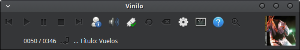
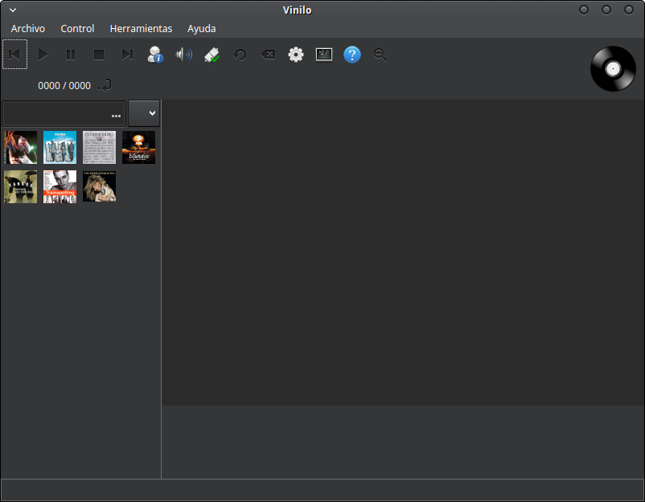
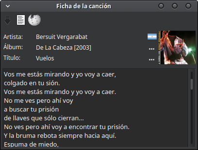

# Vinilo
Music collection managment written in gambas3

## Available languages
Basque:Euskara:eu
Catalan:Català:ca
English:English:en
Esperanto:Esperanto:eo
French:Français:fr
Gallego:Galego:gl
German:Deutsch:de
Greek:Ελληνικά:el
Italian:Italiano:it
Latin:Latina:la
Portuguese:Português:pt
Russian:Русский:ru
Spanish:Español:es

## About Vinilo
Vinilo is a Music collection managment program wrintten in Gambas v3. Vinilo uses sqlite3 database, exiftool and elinks in order to extract auido file mentadata and search over internet lyrics.

## XUtilities
Vinilo is made with the intention to exploit the code of common functions that can be reused in various programs, particularly the work XUtilities Gambas Enhanced Controls [GEG]

## Screenshoots
 
 
 
